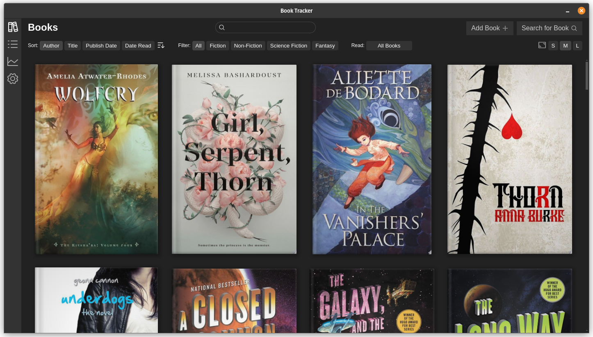
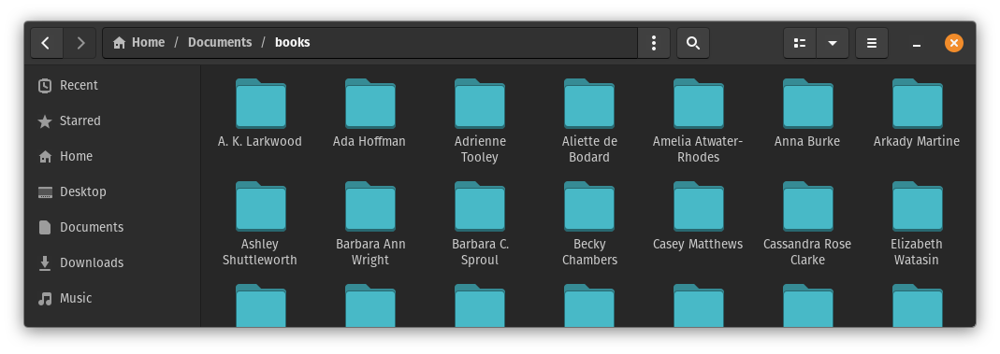

# Book Tracker

A cross-platform desktop app for tracking what books you've read and when.



This is a personal project to track books I've read. Being a personal project, the error handling
is minimal and the UI may not always be obvious.

## Data

When first using, set a directory under :gear: settings to store book data. Data is stored in
easy-to-parse yaml files, with cover images stored alongside them, within author directories. To
share data between devices, you can simply select a directory in a file sharing app like OneDrive,
Google Drive, Dropbox, etc.



```yaml
title: Gideon the Ninth
authors:
  - name: Tamsyn Muir
datePublished: "2019-09-10"
dateRead: "2021-04-15"
googleBooksId: HHJwDwAAQBAJ
hasImage: true
filename: Gideon the Ninth
authorDir: /home/reinii/Documents/books/Tamsyn Muir
series: Locked Tomb
tags:
  - Science Fiction
  - Fantasy
  - Dark Fantasy
```

## Google Cloud API Key

You will need a Google Cloud account to enable the Search functionality to automagically load book
data. [Enable the Books API](https://console.cloud.google.com/apis/api/books.googleapis.com) and
then [create an API key](https://console.cloud.google.com/apis/credentials) that has permissions to
use the Books API.
See [Acquiring and using an API key](https://developers.google.com/books/docs/v1/using#APIKey) for
more details.
