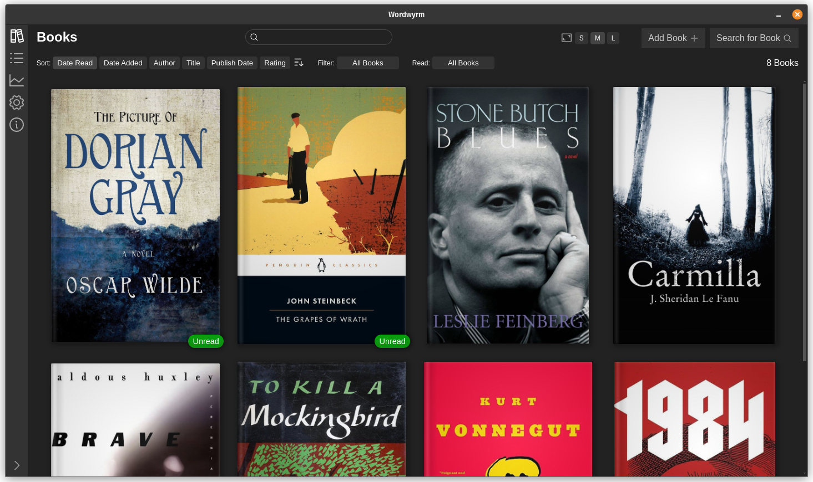

#  Wordwyrm

A cross-platform desktop app for tracking what books you've read and when. The data is stored as
YAML files and JPGs in author directories in a location of your choosing, so you're always in
control of your data.



## Data :open_file_folder:

When first using, set a directory under :gear: settings to store book data. Data is stored in
easy-to-parse yaml files, with cover images stored alongside them, within author directories. To
share data between devices, you can simply select a directory in a file sharing app like OneDrive,
Google Drive, Dropbox, etc.


```yaml
version: "2"
title: Gideon the Ninth
authors:
  - name: Tamsyn Muir
tags:
  - Science Fiction
  - Fantasy
  - Dark Fantasy
series: Locked Tomb
datePublished: "2019-09-10"
dateRead: "2021-04-15"
timestampAdded: 1712277340024
images:
  hasImage: true
  imageUpdated: 1712277341293
ids:
  isbn: "1101443316"
  googleBooksId: HHJwDwAAQBAJ
  goodreadsId: "42036538"
  openLibraryId: /works/OL20128158W
  wikidataId: Q100708760
  internetArchiveId: gideonninth0000muir
```

## Google Cloud :cloud:

The app functions just fine without Google Cloud keys, but these keys enable additional
functionality, including searching Google Books for data and Google Image Search for book covers.

### Books API Key

In order to enable searching Google Books, you will need a Google Cloud account.
[Enable the Books API](https://console.cloud.google.com/apis/api/books.googleapis.com) and
then [create an API key](https://console.cloud.google.com/apis/credentials) that has permissions to
use the **Books API**.
See [Acquiring and using an API key](https://developers.google.com/books/docs/v1/using#APIKey) for
more details.

### Custom Search Engine ID

In order to enable image search for book covers, you will also need a
[Programmable Search Engine](https://programmablesearchengine.google.com/) id. Enable
"Image search" and "Search the entire web" in its settings. Your
[API Key](https://console.cloud.google.com/apis/credentials) will also need the
**Custom Search API** enabled.
